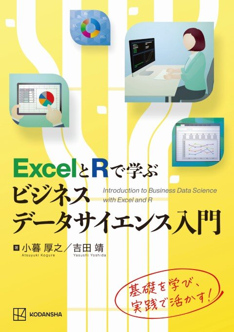

# ExcelとRで学ぶビジネスデータサイエンス入門 ― サポートサイト

  

  <a href="https://www.kspub.co.jp/book/detail/5411339.html" target="_blank" style="background-color:#2f63b3; color:white; padding:10px 18px; border-radius:6px; text-decoration:none; font-weight:600;">
    📘 出版社ページへ（講談社サイエンティフィク）
  </a>

---

## 📖 このサイトについて

本サイトは、書籍  
**『ExcelとRで学ぶビジネスデータサイエンス入門』（講談社サイエンティフィク）**  
の読者向けサポートページです。  

書籍中で使用している **データ（CSV）**、**Rスクリプト**、および **訂正・補足情報（PDF）** を公開しています。  
学習・実習・授業用に自由にご利用ください。

---

## 📂 ダウンロード

### 🔹 データファイル
<a href="data/stock.csv" download>💹 stock.csv（株価データ）</a> 
<a href="data/condo.csv" download>🏙️ condo.csv（中古マンションデータ）</a> 
<a href="data/df_train.csv" download>📊 df_train.csv（第13章ローンデータ）</a>

---

### 🔹 Rスクリプト
<a href="scripts/Rscript_Chaps9-14.R" download>📘 Rscript_Chaps9-14.R（第9〜14章実行用スクリプト）</a>

---

### 🔹 訂正情報・補足資料
<a href="docs/nme_2025.pdf" download>📝 訂正情報（PDF版）をダウンロード</a> 
<a href="docs/chap_13_supplementary.pdf" download>📝 補足資料（PDF版）をダウンロード</a>

## 📚 フォルダ構成

- data/ ... CSVデータ（stock.csv, condo.csv, df_train.csv）
- scripts/ ... Rスクリプト（Rscript_Chaps9-14.R）
- docs/ ... 訂正情報・補足資料PDFなど
- assets/ ... 画像ファイル・CSSファイル
- index.md ... GitHub Pages用トップページ
